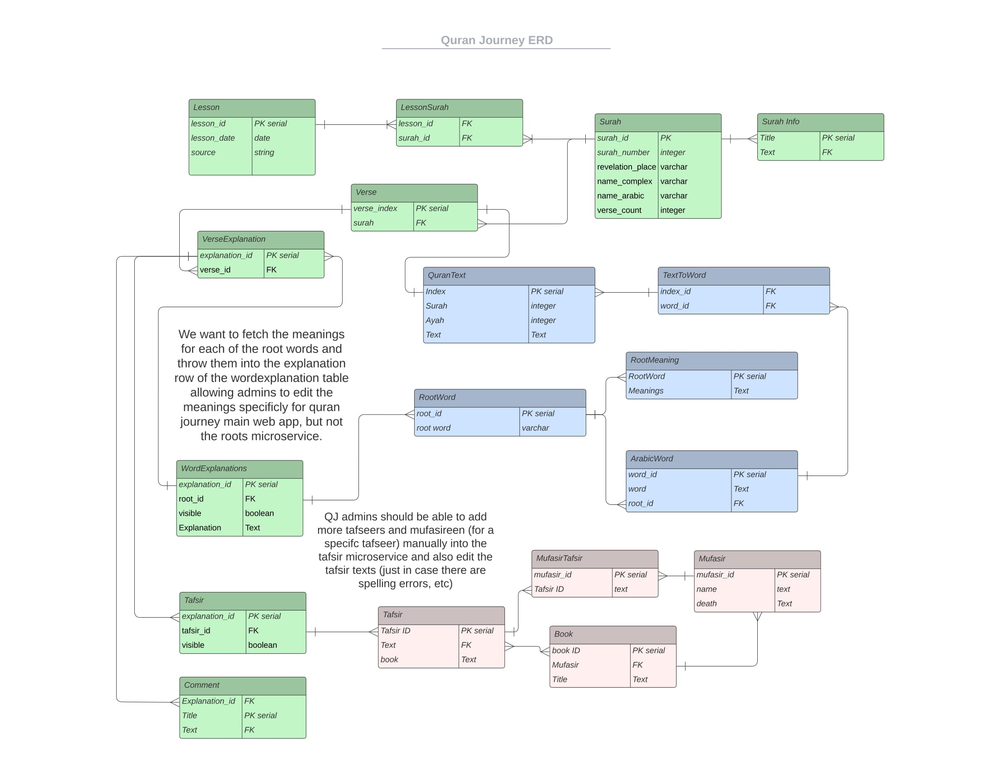

### Database
Below you can see an ERD diagram depicting the project (including other microservices).
In green is this application... the main application. It utilizes two other microservices, the roots microservice is in blue (MVP implemented) and the tafsir microservice is in tan (currently unimplemented). 

The database schema and views are defined in this folder.

There is also a docker-compose file which executes a simple docker container so that you do not need to install docker yourself.

You can run this container in the background using `docker-compose up -d` from inside this folder.

The `-d` will run postgres in the background and you can access logs using `docker-compose logs` inside this folder as well.

To kill the docker instance use `docker-compose down`.

This docker-compose is just so that you don't need to configure postgres on your local machine during development.
